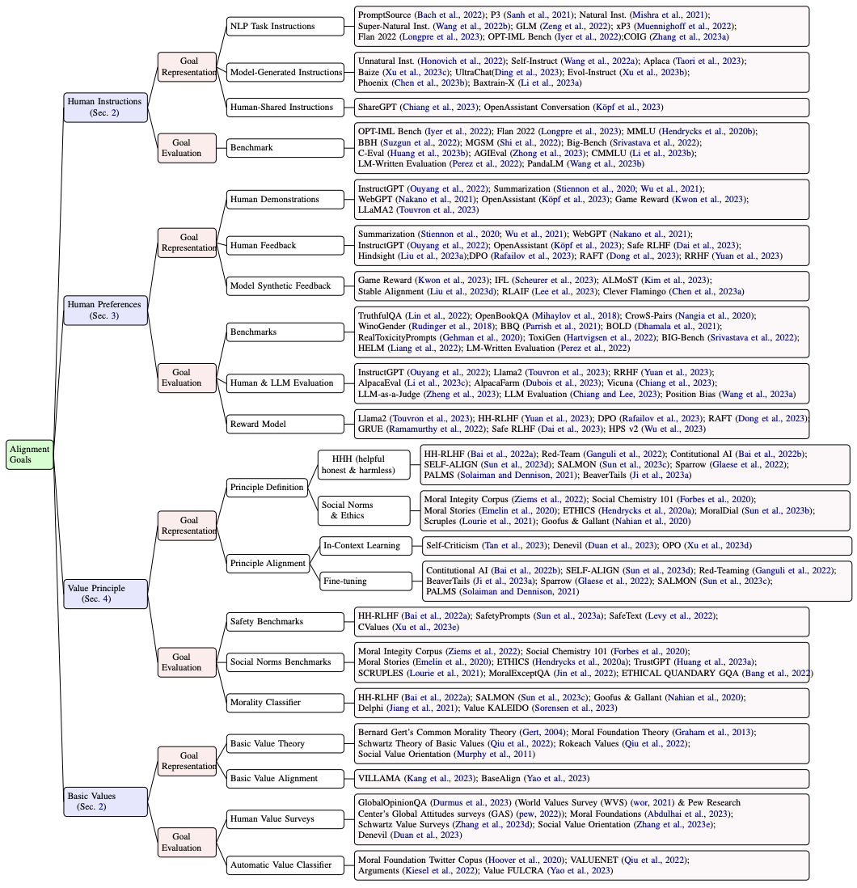

# Alignment Survey
A collection of papers and resources related to alignment targets for big models.

The organization of papers refers to our survey "Value Compass: From Instructions to Intrinsic Human Values —— A Survey of Alignment Target for Big Model".

## Definition of Alignment Targets
### Human Instructions

1. Multitask prompted training enables zero-shot task generalizatio. *Sanh et al.* arXiv 2021. [[Paper](https://arxiv.org/pdf/2110.08207.pdf)]

2. Cross-task generalization via natural language crowdsourcing instructions, *Mishra et al.* arXiv 2021. [[Paper](https://arxiv.org/pdf/2104.08773.pdf)]

3. Super-naturalinstructions: Generalization via declarative instructions on 1600+ nlp tasks. *Wang et al.* arXiv 2022. [[Paper](https://arxiv.org/pdf/2204.07705.pdf)]

4. Glm-130b: An open bilingual pre-trained model. *Zeng et al.* arXiv 2022. [[Paper](https://arxiv.org/pdf/2210.02414.pdf)]

5. Crosslingual generalization through multitask finetuning. *Muennighoff et al.* arXiv 2022. [[Paper](https://arxiv.org/pdf/2211.01786.pdf)]

6. Unnatural instructions: Tuning language models with (almost) no human labor. *Honovich et al.* arXiv 2022. [[Paper](https://arxiv.org/pdf/2212.09689.pdf)]

7. Self-instruct: Aligning language model with self generated instructions. *Wang et al.* arXiv 2022. [[Paper](https://arxiv.org/pdf/2212.10560.pdf)]

8. Scaling instruction-finetuned language models. *Chung et al.* arXiv 2021. [[Paper](https://arxiv.org/pdf/2210.11416.pdf?trk=public_post_comment-text)]

9. The flan collection: Designing data and methods for effective instruction tuning. *Longpre et al.* arXiv 2023. [[Paper](https://arxiv.org/pdf/2301.13688.pdf)]

10. Opt-IML: Scaling language model instruction meta learning through the lens of generalization. *Iyer et al.* arXiv 2022. [[Paper](https://arxiv.org/pdf/2212.12017.pdf)]

11. Stanford alpaca: An instruction-following llama model. *Taori et al.* 2023 [[Blog](https://crfm.stanford.edu/2023/03/13/alpaca.html)]

12. Vicuna: An open-source chatbot impressing gpt-4 with 90\%* chatgpt quality. *Chiang et al.* See https://vicuna 2023. [[Paper](https://lmsys.org/blog/2023-03-30-vicuna/)]

13. Baize: An open-source chat model with parameter-efficient tuning on self-chat data. *Xu et al.* arXiv 2023. [[Paper](https://arxiv.org/pdf/2304.01196.pdf)]

14. Improving multimodal interactive agents with reinforcement learning from human feedback. *Abramson et al.* arXiv 2022. [[Paper](https://arxiv.org/pdf/2211.11602.pdf)]

15. Aligning text-to-image models using human feedback. *Lee et al.* arXiv 2023. [[Paper](https://arxiv.org/pdf/2302.12192.pdf)]

16. Visual instruction tuning. *Liu et al.* arXiv 2023. [[Paper](https://arxiv.org/pdf/2307.01003.pdf)]

17. Llavar: Enhanced visual instruction tuning for text-rich image understanding. *Zhang et al.* arXiv 2023. [[Paper](https://arxiv.org/pdf/2306.17107.pdf)]

### Human Preferences
#### Human Demonstrations
1. Training language models to follow instructions with human feedback. *Ouyang et al.* Neurips 2022. [[Paper](https://proceedings.neurips.cc/paper_files/paper/2022/file/b1efde53be364a73914f58805a001731-Paper-Conference.pdf)]

2. Learning to summarize with human feedback. *Stiennon et al.* Neurips 2020. [[Paper](https://proceedings.neurips.cc/paper/2020/file/1f89885d556929e98d3ef9b86448f951-Paper.pdf)]

3. Recursively summarizing books with human feedback. *Wu et al.* arXiv 2021. [[Paper](https://arxiv.org/pdf/2109.10862.pdf)]

4. Webgpt: Browser-assisted question-answering with human feedback. *Nakano et al.* arXiv 2021. [[Paper](https://arxiv.org/pdf/2112.09332.pdf)]

5. OpenAssistant Conversations--Democratizing Large Language Model Alignment. *Kopf et al.* arXiv 2023. [[Paper](https://arxiv.org/pdf/2304.07327.pdf)]

6. Reward design with language models. *Kwon et al.* arXiv 2023. [[Paper](https://arxiv.org/pdf/2303.00001.pdf)]

#### Human Feedback
1. Training language models to follow instructions with human feedback. *Ouyang et al.* Neurips 2022. [[Paper](https://proceedings.neurips.cc/paper_files/paper/2022/file/b1efde53be364a73914f58805a001731-Paper-Conference.pdf)]

2. Learning to summarize with human feedback. *Stiennon et al.* Neurips 2020. [[Paper](https://proceedings.neurips.cc/paper/2020/file/1f89885d556929e98d3ef9b86448f951-Paper.pdf)]

3. Recursively summarizing books with human feedback. *Wu et al.* arXiv 2021. [[Paper](https://arxiv.org/pdf/2109.10862.pdf)]

4. Webgpt: Browser-assisted question-answering with human feedback. *Nakano et al.* arXiv 2021. [[Paper](https://arxiv.org/pdf/2112.09332.pdf)]

5. OpenAssistant Conversations--Democratizing Large Language Model Alignment. *Kopf et al.* arXiv 2023. [[Paper](https://arxiv.org/pdf/2304.07327.pdf)]

6. Human Preference Score v2: A Solid Benchmark for Evaluating Human Preferences of Text-to-Image Synthesis. *Wu et al.* arXiv 2023. [[Paper](https://arxiv.org/pdf/2306.09341.pdf)]

7. Visual Instruction Tuning with Polite Flamingo. *Chen et al.* arXiv 2023. [[Paper](https://arxiv.org/pdf/2307.01003.pdf)]

#### Model Synthetic Feedback 
Fine-tuning language models from human preferences. *Ziegler et al.* arXiv 2019. [[Paper](https://arxiv.org/pdf/1909.08593.pdf)]

1. Reward design with language models. *Kwon et al.* arXiv 2023. [[Paper](https://arxiv.org/pdf/2303.00001.pdf)]

2. Aligning Large Language Models through Synthetic Feedback. *Kim et al.* arXiv 2023. [[Paper](https://arxiv.org/pdf/2305.13735.pdf)]

3. Training Socially Aligned Language Models in Simulated Human Society. *Liu et al.* arXiv 2023. [[Paper](https://arxiv.org/pdf/2305.16960.pdf)]

4. Training Language Models with Language Feedback at Scale. *Jeremy Scheurer et al.* arXiv 2023. [[Paper](https://arxiv.org/pdf/2303.16755.pdf)]

### Human Values
#### Value Principles
##### HHH (Helpful & Honest & Harmless)
1. Training language models to follow instructions with human feedback. *Ouyang et al.* Neurips 2022. [[Paper](https://proceedings.neurips.cc/paper_files/paper/2022/file/b1efde53be364a73914f58805a001731-Paper-Conference.pdf)]

2. A general language assistant as a laboratory for alignment. *Askell et al.* arXiv 2021. [[Paper](https://arxiv.org/pdf/2112.00861.pdf)]

3. Training a helpful and harmless assistant with reinforcement learning from human feedback. *Bai et al.* arXiv 2022. [[Paper](https://arxiv.org/pdf/2204.05862.pdf)]

4. Improving alignment of dialogue agents via targeted human judgements. *Glaese et al.* arXiv 2022. [[Paper](https://arxiv.org/pdf/2209.14375.pdf)]

5. Constitutional ai: Harmlessness from ai feedback. *Bai et al.* arXiv 2022. [[Paper](https://arxiv.org/pdf/2212.08073.pdf)]

6. Principle-driven self-alignment of language models from scratch with minimal human supervision. *Sun et al.* arXiv 2023. [[Paper](https://arxiv.org/pdf/2305.03047.pdf)]

7. Process for adapting language models to society (palms) with values-targeted datasets. *Solaiman et al.* Neurips 2021. [[Paper](https://proceedings.neurips.cc/paper_files/paper/2021/file/2e855f9489df0712b4bd8ea9e2848c5a-Paper.pdf)]

##### Social Norms & Ethics
1. The moral integrity corpus: A benchmark for ethical dialogue systems. *Ziems et al.* arXiv 2022. [[Paper](https://arxiv.org/pdf/2204.03021.pdf)]

2. Social chemistry 101: Learning to reason about social and moral norms. *Forbes et al.* arXiv 2020. [[Paper](https://arxiv.org/pdf/2011.00620.pdf)]

3. Moral stories: Situated reasoning about norms, intents, actions, and their consequences. *Emelin et al.* arXiv 2020. [[Paper](https://arxiv.org/pdf/2012.15738.pdf)]

4. Aligning ai with shared human values. *Hendrycks et al.* arXiv 2020. [[Paper](https://arxiv.org/pdf/2008.02275.pdf)]

5. Scruples: A corpus of community ethical judgments on 32,000 real-life anecdotes. *Lourie et al.* AAAI 2021. [[Paper](https://ojs.aaai.org/index.php/AAAI/article/view/17589/17396)]

6. MoralDial: A Framework to Train and Evaluate Moral Dialogue Systems via Moral Discussions. *Sun et al.* ACL 2023. [[Paper](https://arxiv.org/pdf/2212.10720.pdf)]

7. Learning norms from stories: A prior for value aligned agents. *Nahian et al.* AIES 2020. [[Paper](https://arxiv.org/pdf/1912.03553.pdf)]

##### Basic Value Theory
1. An overview of the Schwartz theory of basic values. *Schwartz et al.* Online readings in Psychology and Culture 2012. [[Paper](https://scholarworks.gvsu.edu/cgi/viewcontent.cgi?article=1116&context=orpc)]

2. Rokeach value survey. *Rokeach et al.* The nature of human values. 1967. [[Paper](https://en.wikipedia.org/wiki/Rokeach_Value_Survey)]

3. Life values inventory: Facilitator's guide. *Brown et al.* Willianmsburg, VA 2002. [[Paper](https://www.lifevaluesinventory.org/LifeValuesInventory.org%20-%20Facilitators%20Guide%20Sample.pdf)]

4. Moral foundations theory: The pragmatic validity of moral pluralism. *Graham et al.* Advances in experimental social psychology, 2013. [[Paper](https://www.sciencedirect.com/science/article/abs/pii/B9780124072367000024)]

#### Target Representation
##### Desirable Behaviors
1. Training a helpful and harmless assistant with reinforcement learning from human feedback. *Bai et al.* arXiv 2022. [[Paper](https://arxiv.org/pdf/2204.05862.pdf)]

2. Red teaming language models to reduce harms: Methods, scaling behaviors, and lessons learned. *Ganguliet al.* arXiv 2022. [[Paper](https://arxiv.org/pdf/2209.07858.pdf)]

3. Training language models to follow instructions with human feedback. *Ouyang et al.* Neurips 2022. [[Paper](https://proceedings.neurips.cc/paper_files/paper/2022/file/b1efde53be364a73914f58805a001731-Paper-Conference.pdf)]

4. Aligning ai with shared human values. *Hendrycks et al.* arXiv 2020. [[Paper](https://arxiv.org/pdf/2008.02275.pdf)]

5. Social bias frames: Reasoning about social and power implications of language. *Sap et al.* arXiv 2019. [[Paper](https://arxiv.org/pdf/1911.03891.pdf)]

##### Intrinsic Values
1. Improving alignment of dialogue agents via targeted human judgements. *Glaese et al.* arXiv 2022. [[Paper](https://arxiv.org/pdf/2209.14375.pdf)]

2. Constitutional ai: Harmlessness from ai feedback. *Bai et al.* arXiv 2022. [[Paper](https://arxiv.org/pdf/2212.08073.pdf)]

3. Principle-driven self-alignment of language models from scratch with minimal human supervision. *Sun et al.* arXiv 2023. [[Paper](https://arxiv.org/pdf/2305.03047.pdf)]

4. Process for adapting language models to society (palms) with values-targeted datasets. *Solaiman et al.* Neurips 2021. [[Paper](https://proceedings.neurips.cc/paper_files/paper/2021/file/2e855f9489df0712b4bd8ea9e2848c5a-Paper.pdf)]

5. The moral integrity corpus: A benchmark for ethical dialogue systems. *Ziems et al.* arXiv 2022. [[Paper](https://arxiv.org/pdf/2204.03021.pdf)]

6. Social chemistry 101: Learning to reason about social and moral norms. *Forbes et al.* arXiv 2020. [[Paper](https://arxiv.org/pdf/2011.00620.pdf)]

7. Moral stories: Situated reasoning about norms, intents, actions, and their consequences. *Emelin et al.* arXiv 2020. [[Paper](https://arxiv.org/pdf/2012.15738.pdf)]

8. Can machines learn morality? the delphi experiment. *Jiang et al.* arXiv 2021. [[Paper](https://arxiv.org/pdf/2110.07574.pdf?mc_cid=8a253cb85a&mc_eid=8760535dd2)]

The capacity for moral self-correction in large language models. *Ganguli et al.* arXiv 2023. [[Paper](https://arxiv.org/pdf/2302.07459.pdf)]

## Evaluation of Alignment Targets
### Human Instructions
#### Benchmarks
1. Multitask prompted training enables zero-shot task generalizatio. *Sanh et al.* arXiv 2021. [[Paper](https://arxiv.org/pdf/2110.08207.pdf)]

2. Super-naturalinstructions: Generalization via declarative instructions on 1600+ nlp tasks. *Wang et al.* arXiv 2022. [[Paper](https://arxiv.org/pdf/2204.07705.pdf)]

3. The flan collection: Designing data and methods for effective instruction tuning. *Longpre et al.* arXiv 2023. [[Paper](https://arxiv.org/pdf/2301.13688.pdf)]

4. Opt-IML: Scaling language model instruction meta learning through the lens of generalization. *Iyer et al.* arXiv 2022. [[Paper](https://arxiv.org/pdf/2212.12017.pdf)]

5. Beyond the imitation game: Quantifying and extrapolating the capabilities of language models. *Srivastava et al.* arXiv 2022. [[Paper](https://arxiv.org/pdf/2206.04615.pdf)]

6. C-eval: A multi-level multi-discipline chinese evaluation suite for foundation models. *Huang et al.* arXiv 2023. [[Paper](https://arxiv.org/pdf/2305.08322.pdf)]

7. Agieval: A human-centric benchmark for evaluating foundation models. *Zhong et al.* arXiv 2023. [[Paper](https://arxiv.org/pdf/2304.06364.pdf)]

8. Discovering language model behaviors with model-written evaluations. *Perez et al.* arXiv 2022. [[Paper](https://arxiv.org/pdf/2212.09251.pdf?fbclid=IwAR1Rfg18V_AiEk1X5H_7E1i1SXnH9g4FxVDSCvFW41LDBMcKAkUzltP9Jas)]

#### Automatic Chatbot Arenas
1. Alpacaeval: An automatic evaluator of instruction-following models. *Li et al.* 2023. [[Project](https://github.com/tatsu-lab/alpaca_eval)]

2. Alpacafarm: A simulation framework for methods that learn from human feedback. *Dubois et al.* arXiv 2023. [[Paper](https://arxiv.org/pdf/2305.14387.pdf)]

3. Vicuna: An open-source chatbot impressing gpt-4 with 90\%* chatgpt quality. *Chiang et al.* See https://vicuna 2023. [[Paper](https://lmsys.org/blog/2023-03-30-vicuna/)]

4. Judging LLM-as-a-judge with MT-Bench and Chatbot Arena. *Zheng et al.* arXiv 2023. [[Paper](https://arxiv.org/pdf/2306.05685.pdf)]

### Human Preferences
#### Benchmarks
1. TruthfulQA: Measuring how models mimic human falsehoods. *Lin et al.* arXiv 2022. [[Paper](https://arxiv.org/pdf/2109.07958.pdf)]

2. Can a Suit of Armor Conduct Electricity? A New Dataset for Open Book Question Answering. *Mihaylov et al.* EMNLP 2018. [[Paper](https://arxiv.org/pdf/1809.02789.pdf)]

3. CrowS-pairs: A challenge dataset for measuring social biases in masked language models. *Nangia et al.* arXiv 2020. [[Paper](https://arxiv.org/pdf/2010.00133.pdf)]

4. Gender bias in coreference resolution. *Rudinger et al.* arXiv 2018. [[Paper](https://arxiv.org/pdf/1804.09301.pdf)]

5. BBQ: A hand-built bias benchmark for question answering. *Parrish et al.* arXiv 2021. [[Paper](https://arxiv.org/pdf/2110.08193.pdf)]

6. Bold: Dataset and metrics for measuring biases in open-ended language generation. *Dhamala et al.* FAccT 2021. [[Paper](https://arxiv.org/pdf/2101.11718.pdf)]

7. Realtoxicityprompts: Evaluating neural toxic degeneration in language models. *Gehman et al.* arXiv 2020. [[Paper](https://aclanthology.org/2020.findings-emnlp.301.pdf)]

8. Toxigen: A large-scale machine-generated dataset for adversarial and implicit hate speech detection. *Hartvigsen et al.* arXiv 2022. [[Paper](https://arxiv.org/pdf/2203.09509.pdf)]

9. Beyond the imitation game: Quantifying and extrapolating the capabilities of language models. *Srivastava et al.* arXiv 2022. [[Paper](https://arxiv.org/pdf/2206.04615.pdf)]

10. Holistic evaluation of language models. *Liang et al.* arXiv 2022. [[Paper](https://arxiv.org/pdf/2211.09110.pdf)]

11. Discovering language model behaviors with model-written evaluations. *Perez et al.* arXiv 2022. [[Paper](https://arxiv.org/pdf/2212.09251.pdf?fbclid=IwAR1Rfg18V_AiEk1X5H_7E1i1SXnH9g4FxVDSCvFW41LDBMcKAkUzltP9Jas)]

12. Red teaming ChatGPT via Jailbreaking: Bias, Robustness, Reliability and Toxicity. *Zhuo et al.* arXiv 2023. [[Paper](https://arxiv.org/pdf/2301.12867.pdf)]

#### Human Evaluation
1. Training language models to follow instructions with human feedback. *Ouyang et al.* Neurips 2022. [[Paper](https://proceedings.neurips.cc/paper_files/paper/2022/file/b1efde53be364a73914f58805a001731-Paper-Conference.pdf)]

2. Llama 2: Open foundation and fine-tuned chat models. *Touvronet al.* arXiv 2023. [[Paper](https://arxiv.org/pdf/2307.09288v2.pdf)]

3. Rrhf: Rank responses to align language models with human feedback without tears. *Yuan et al.* arXiv 2023. [[Paper](https://arxiv.org/pdf/2304.05302.pdf)]

4. Learning to summarize with human feedback. *Stiennon et al.* Neurips 2020. [[Paper](https://proceedings.neurips.cc/paper/2020/file/1f89885d556929e98d3ef9b86448f951-Paper.pdf)]

5. Aligning Large Language Models through Synthetic Feedback. *Kim et al.* arXiv 2023. [[Paper](https://arxiv.org/pdf/2305.13735.pdf)]

#### Reward Model
1. Llama 2: Open foundation and fine-tuned chat models. *Touvronet al.* arXiv 2023. [[Paper](https://arxiv.org/pdf/2307.09288v2.pdf)]

2. Training a helpful and harmless assistant with reinforcement learning from human feedback. *Bai et al.* arXiv 2022. [[Paper](https://arxiv.org/pdf/2204.05862.pdf)]

3. Direct preference optimization: Your language model is secretly a reward model. *Rafailov et al.* arXiv 2023. [[Paper](https://arxiv.org/pdf/2305.18290.pdf?trk=public_post_comment-text)]

4. Raft: Reward ranked finetuning for generative foundation model alignment. *Dong et al.* arXiv 2023. [[Paper](https://arxiv.org/pdf/2304.06767.pdf)]

5. Is reinforcement learning (not) for natural language processing?: Benchmarks, baselines, and building blocks for natural language policy optimization. *Ramamurthy et al.* arXiv 2022. [[Paper](https://arxiv.org/pdf/2210.01241.pdf)]

### Human Values
#### Benchmarks
1. Training a helpful and harmless assistant with reinforcement learning from human feedback. *Bai et al.* arXiv 2022. [[Paper](https://arxiv.org/pdf/2204.05862.pdf)]

2. Safety Assessment of Chinese Large Language Models. *Sun et al.* arXiv 2023. [[Paper](https://arxiv.org/pdf/2304.10436.pdf)]

3. SafeText: A benchmark for exploring physical safety in language models. *Levy et al.* arXiv 2022. [[Paper](https://arxiv.org/pdf/2210.10045.pdf)]

4. CValues: Measuring the Values of Chinese Large Language Models from Safety to Responsibility. *Xu et al.* arXiv 2023. [[Paper](https://arxiv.org/pdf/2307.09705.pdf)]

5. The moral integrity corpus: A benchmark for ethical dialogue systems. *Ziems et al.* arXiv 2022. [[Paper](https://arxiv.org/pdf/2204.03021.pdf)]

6. Social chemistry 101: Learning to reason about social and moral norms. *Forbes et al.* arXiv 2020. [[Paper](https://arxiv.org/pdf/2011.00620.pdf)]

7. Moral stories: Situated reasoning about norms, intents, actions, and their consequences. *Emelin et al.* arXiv 2020. [[Paper](https://arxiv.org/pdf/2012.15738.pdf)]

8. Aligning ai with shared human values. *Hendrycks et al.* arXiv 2020. [[Paper](https://arxiv.org/pdf/2008.02275.pdf)]

9. Scruples: A corpus of community ethical judgments on 32,000 real-life anecdotes. *Lourie et al.* AAAI 2021. [[Paper](https://ojs.aaai.org/index.php/AAAI/article/view/17589/17396)]

10. Moral mimicry: Large language models produce moral rationalizations tailored to political identity. *Simmons et al.* arXiv 2022. [[Paper](https://arxiv.org/pdf/2209.12106.pdf)]

11. When to make exceptions: Exploring language models as accounts of human moral judgment. *Jin et al.* Neurips 2022. [[Paper](https://proceedings.neurips.cc/paper_files/paper/2022/file/b654d6150630a5ba5df7a55621390daf-Paper-Conference.pdf)]

12. Towards Answering Open-ended Ethical Quandary Questions. *Bang et al.* arXiv 2022. [[Paper](https://amulyayadav.github.io/AI4SG2023/images/22.pdf)]

#### Reward Model
1. Learning norms from stories: A prior for value aligned agents. *Nahian et al.* AIES 2020. [[Paper](https://arxiv.org/pdf/1912.03553.pdf)]

2. Training a helpful and harmless assistant with reinforcement learning from human feedback. *Bai et al.* arXiv 2022. [[Paper](https://arxiv.org/pdf/2204.05862.pdf)]

3. Can machines learn morality? the delphi experiment. *Jiang et al.* arXiv 2021. [[Paper](https://arxiv.org/pdf/2110.07574.pdf?mc_cid=8a253cb85a&mc_eid=8760535dd2)]

4. Valuenet: A new dataset for human value driven dialogue system. *Qiu et al.* AAAI 2022. [[Paper](https://ojs.aaai.org/index.php/AAAI/article/download/21368/21117)]

5. Moral foundations twitter corpus: A collection of 35k tweets annotated for moral sentiment. *Hoover et al.* Social Psychological and Personality Science 2020. [[Paper](https://journals.sagepub.com/doi/epub/10.1177/1948550619876629)]

6. Large pre-trained language models contain human-like biases of what is right and wrong to do. *Schramowski et al.* Nature Machine Intelligence 2022. [[Paper](https://arxiv.org/pdf/2103.11790.pdf)]

#### Human Value Surveys
1. Towards Measuring the Representation of Subjective Global Opinions in Language Models. *Durmus et al.* arXiv 2023. [[Paper](https://arxiv.org/pdf/2306.16388.pdf)]

2. Culture's consequences: International differences in work-related values. *Hofstede et al.* 1984. [[Paper](https://books.google.com/books/about/Culture_s_Consequences.html?id=Cayp_Um4O9gC)]

3. World Values Survey Wave 7 (2017-2022). [[URL](https://www.worldvaluessurvey.org/WVSDocumentationWV7.jsp)]

4. European Values Study. [[URL](https://europeanvaluesstudy.eu/)]

5. Pew Researcj Center's Global Attitudes Surveys (GAS) [[URL](https://www.pewresearch.org/)]

6. An overview of the Schwartz theory of basic values. *Schwartz et al.* Online readings in Psychology and Culture 2012. [[Paper](https://scholarworks.gvsu.edu/cgi/viewcontent.cgi?article=1116&context=orpc)]

7. Probing pre-trained language models for cross-cultural differences in values. *Arora et al.* arXiv 2022. [[Paper](https://arxiv.org/pdf/2203.13722.pdf)]